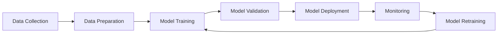

# MLOps (Machine Learning Operations)

## What is MLOps?

MLOps is a set of practices that combines Machine Learning (ML) and DevOps to deploy and maintain ML models in production reliably and efficiently. It bridges the gap between data science and operations teams.

## Key Components of MLOps

### 1. Data Management
- **Data Versioning**: Track changes in datasets over time
- **Data Quality**: Ensure data consistency and accuracy
- **Data Pipeline**: Automated data ingestion and preprocessing

### 2. Model Development
- **Experiment Tracking**: Monitor and compare model experiments
- **Model Versioning**: Version control for ML models
- **Collaborative Development**: Enable team collaboration on ML projects

### 3. Model Deployment
- **Continuous Integration/Continuous Deployment (CI/CD)**: Automated testing and deployment
- **Model Serving**: Deploy models as APIs or batch processes
- **A/B Testing**: Compare model performance in production

### 4. Monitoring & Maintenance
- **Model Performance Monitoring**: Track model accuracy and drift
- **Infrastructure Monitoring**: Monitor system resources and health
- **Automated Retraining**: Trigger model updates based on performance metrics

## MLOps Lifecycle

## Popular MLOps Tools

### Data & Experiment Management
- **MLflow**: Open-source platform for ML lifecycle management
- **Weights & Biases (W&B)**: Experiment tracking and model management
- **DVC**: Data version control for ML projects
- **Kubeflow**: Kubernetes-native ML workflows

### Model Deployment
- **Docker**: Containerization for consistent deployments
- **Kubernetes**: Container orchestration for scalable deployments
- **Apache Airflow**: Workflow orchestration
- **Seldon Core**: ML deployment on Kubernetes

### Cloud Platforms
- **AWS SageMaker**: End-to-end ML platform
- **Google Cloud AI Platform**: ML services and tools
- **Azure Machine Learning**: Cloud-based ML service
- **Databricks**: Unified analytics platform

## Best Practices

### 1. Version Everything
- Code, data, models, and configurations
- Use Git for code and specialized tools for data/models

### 2. Automate Testing
- Unit tests for code
- Data validation tests
- Model performance tests

### 3. Monitoring is Critical
- Monitor data drift
- Track model performance degradation
- Set up alerts for anomalies

### 4. Reproducibility
- Use containerization (Docker)
- Pin dependencies and versions
- Document environments and processes

### 5. Security & Compliance
- Implement access controls
- Ensure data privacy
- Maintain audit trails

## Common Challenges in MLOps

1. **Model Drift**: When model performance degrades over time due to changing data patterns
2. **Data Quality**: Ensuring consistent, clean data throughout the pipeline
3. **Scalability**: Handling increased load and data volume
4. **Team Collaboration**: Bridging the gap between data scientists and engineers
5. **Regulatory Compliance**: Meeting industry-specific requirements

## MLOps Maturity Levels

### Level 0: Manual Process
- Manual, script-driven process
- Disconnect between ML and operations

### Level 1: ML Pipeline Automation
- Automated training pipeline
- Continuous training of models

### Level 2: CI/CD Pipeline Automation
- Automated building, testing, and deployment
- Fast and reliable model updates

## Getting Started with MLOps

1. **Start Small**: Begin with basic version control and experiment tracking
2. **Choose the Right Tools**: Select tools that fit your team size and requirements
3. **Focus on Automation**: Gradually automate manual processes
4. **Implement Monitoring**: Set up basic monitoring from the start
5. **Build Team Skills**: Invest in training and cross-functional collaboration

## Conclusion

MLOps is essential for successfully deploying and maintaining ML models in production. It requires a combination of technical tools, processes, and cultural changes to bridge the gap between development and operations teams.